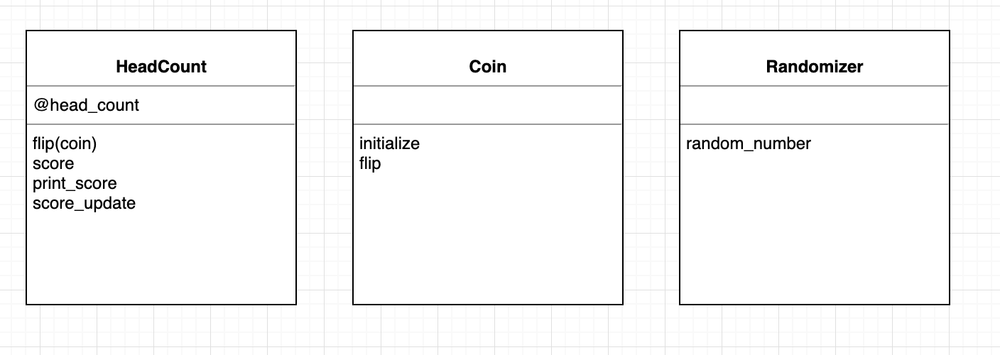
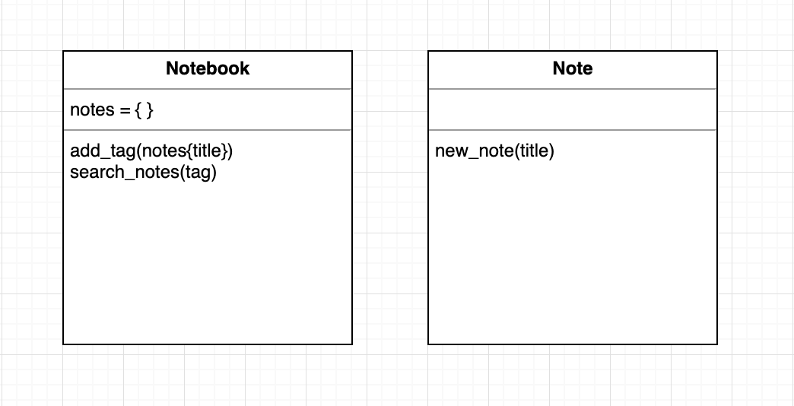

# Domain Modelling

This repository is for the Makers course. It will focus on the idea of domain modelling.

Domain modelling is a very important initial step when designing programs and how those programs will work. Domain models create a visual representation of how code will interect with it's self. These models will help drive code architecture, decision making and implementation. There are several ways to create visual models of programs. A simple versions will use lists, tables and boxes to represent the "verb" methods and "noun" objects. A more complex version may use Unified Modelling Language to create diagrams.

The benifits of good domain modelling include:

* **Saving time and effort** - Modelling is cheap and easy. Discovering design and implementation flaws _before_ writing code(or at the very start) saves unpicking those mistakes later. If starting the code is hard when looking at the model, chances are the model needs changing.

* **Helps stay on track** - Having a clear picture of what you want to build and what you _need_ to build. This helps keep time focused on writing the correct code and not any extra code that is not needed.

* **Write good tests** - Tests can be written for methods and classes knowing how they will interact with each other. 

## Examples


### Coin flip

This example takes the following user stories.

```
As a person
So I can have fun
I want to be able to flip a coin and find out if it came up heads or tails
```
```
As a person
So I can keep score
I want to be able to find out how many times the coin comes up heads
```
```
As a person
So I can remember my best score
I want to be able to print out my score
```

And translates into the following class diagram.



From the class diagram [this code](coin-flip.rb) was the final output.

### Notebook

This example takes the following user stories.

```
As an office worker
So I can record useful information
I want to be able to create a text note
```
```
As an office worker
So I can carry all my useful information
I want to keep all my notes in a notebook.
```
```
As an office worker
So I can categorise a note
I want to be able to add a tag (only one tag) to a note
```
```
As an office worker
So I can find notes on a certain topic
I want to be able to search for all the notes with a specific tag
```

And translates into the following class diagram.




When starting to scaffold code it became clear the class diagram was not quite right. For example, it did not show fully how the note would be created and user input gained. The next step would be to return back to the diagram and revise. This stopped wasted time and resources in the coding stage.  